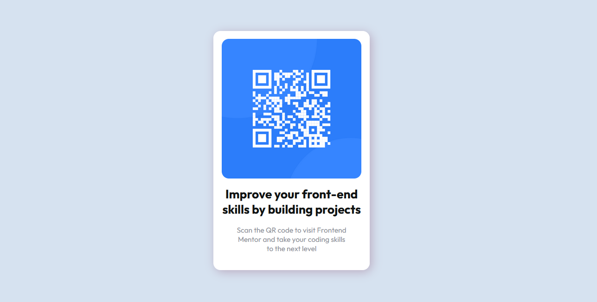

# Frontend Mentor - QR code component solution

This is a solution to the [QR code component challenge on Frontend Mentor](https://www.frontendmentor.io/challenges/qr-code-component-iux_sIO_H). Frontend Mentor challenges help you improve your coding skills by building realistic projects.

## Table of contents

- [Overview](#overview)
  - [Screenshot](#screenshot)
- [My process](#my-process)
  - [Built with](#built-with)
  - [What I learned](#what-i-learned)
- [Acknowledgments](#acknowledgments)

## Overview

### Screenshot

## Built with

pure css and html

## What I learned

i learned about aspect ratio and they way to calculate and maintain it also about image as to keep at 100%.

## Acknowledgments

thanks to https://www.frontendmentor.io for providing such good material for learners to practice on.
